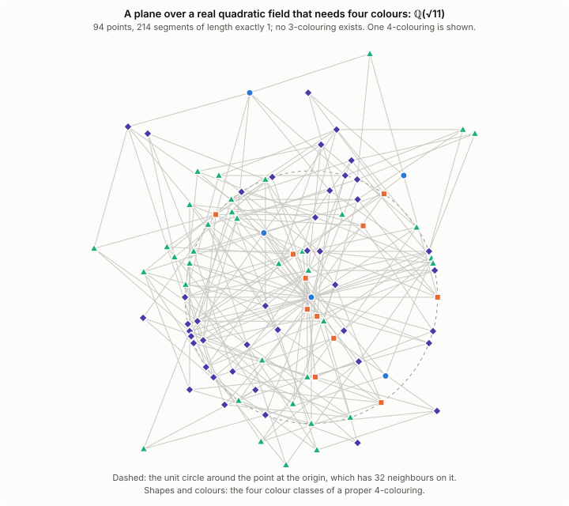

# The Hadwiger–Nelson problem over number fields

**Sergi Galán** · research repository, 2026

[](https://github.com/decalion89/chromatic-number-of-the-plane/actions/workflows/tests.yml)
[](https://github.com/decalion89/chromatic-number-of-the-plane/actions/workflows/lean.yml)
[](https://doi.org/10.5281/zenodo.22976635)
[](LICENSE)
[](#how-this-work-was-done)


The Hadwiger–Nelson problem asks for the chromatic number χ(ℝ²) of the plane: the least number of
colours such that no two points at distance exactly 1 share a colour. It has been known since 2018 that
χ(ℝ²) is 5, 6 or 7.

| bound | who, when | how |
|---|---|---|
| χ(ℝ²) ≥ 4 | Nelson, 1950; L. and W. Moser, 1961 | the 7-vertex Moser spindle |
| χ(ℝ²) ≥ 5 | de Grey, 2018 | a 1581-vertex unit-distance graph with no 4-colouring |
| χ(ℝ²) ≥ 5 | Parts, 2020 | the same property on 509 vertices |
| χ(ℝ²) ≤ 7 | Isbell, 1950 | a hexagonal tiling |

Soifer's book (2024) tells the history of the problem and of these bounds.

This repository studies the problem through exact arithmetic in number fields:
- every point has algebraic coordinates, so "distance 1" is decided exactly;
- claims that a graph cannot be coloured are decided by SAT solvers, and the main ones are certified by
  DRAT proofs checked by an independent program (`drat-trim`);
- the two theorems below are also proved in Lean 4.

**Status (October 2026):** AI-assisted research; nothing here has been refereed yet. Each result states
its evidence, with the statuses of [Results](#results).

## Main result

> **Theorem.** χ(ℚ(√2, √3)²) = 4. The same argument gives a short proof of
> K. G. Fischer's theorem χ(ℚ(√3, √11)²) = 4 (1994).

Both planes can be coloured with four colours, and both contain unit-distance graphs that need four.
ℚ(√3, √11) is the smallest field whose plane contains a Moser spindle (Moorhouse, 2010).

- **Background.** Fischer proved χ(ℚ(√3, √11)²) = 4 in 1994 (*Congressus Numerantium* 104). His result
  seems to have been overlooked: Moorhouse (2010), Madore (2015, who proved 4 ≤ χ ≤ 5), Cranston–Rabern
  (2017), Exoo–Ismailescu (2020) and Voronov (Polymath16, 2021) all treat the value as unknown. Voronov
  also thought χ = 4 likely for the plane over ℚ(√2, √3). Fischer's hypotheses, as the zbMATH review of
  his 1994 paper states them (we have not seen its full text), exclude that field, and we had not found
  its value in the literature when we wrote the note (but see the next point).
- **Found later (28 September 2026).** The upper bound χ ≤ 4 for both planes is also a case of earlier
  public work: *A 2-adic obstruction to 5-chromatic unit-distance graphs*
  ([hn-2adic-obstruction](https://github.com/MildlyMeticulous/hn-2adic-obstruction), a repository of July 2026, not refereed). Its Theorem A is the
  same reduction of z = x + iy at a place over 2; its Corollary B′ covers a field that contains ℚ(√2, √3)
  and ℚ(√3, √11); it proves χ(ℚ(√3, √11)²) = 4. It does not state the case ℚ(√2, √3). What remains ours:
  the explicit value for ℚ(√2, √3), with its 10-vertex lower bound, and the Lean proofs.
- **Proof idea.** Change coordinates to α = x + y/√3, β = 2y/√3. The squared distance becomes
  α² − αβ + β². This form is anisotropic modulo a prime above 2 with residue field 𝔽₂, so Madore's
  reduction argument, which he stated for any quadratic form, applies. Reducing (α, β) modulo that prime,
  after subtracting fixed coset representatives, gives a proper 4-colouring of the whole plane. Speyer
  used reduction modulo 2 in 2018 to 4-colour the Moser ring; on that ring our colouring is one of his.
- **Status.** Proved, and formally verified in Lean 4 with Mathlib: both theorems depend only on Lean's
  three standard axioms. The colourings were also tested by computer on finite unit-distance graphs with
  up to 3 134 vertices. Not yet refereed.

**Read:** [the note (PDF)](papers/planes-4-chromatic/planes-4-chromatic.pdf) ·
[the Lean proofs](lean/README.md) ·
[full details](notes/local_colourings.md) (§8 and §10) ·
[comparison with the literature](notes/literature.md)

**Check:**

```sh
python3 -m pytest -q tests/test_q23.py tests/test_q311.py                        # seconds
cd lean && lake exe cache get && lake build && lake env lean PrintAxioms.lean   # minutes; needs elan
```

<details>
<summary><b>What was known, and what is new</b></summary>

According to the zbMATH review of his 1994 paper (*A planar geometric graph of chromatic number four*,
Congr. Numer. 104, 73–79), Fischer proved that ℚ(√p, √q)² has an additive 4-colouring for squarefree,
relatively prime p ≡ 3, q ≡ 11 (mod 16) with pq ≡ 1 (mod 32); for ℚ(√3, √11) the Moser spindle gives the
lower bound. In later work:
- Moorhouse (2010) left the value undetermined.
- Madore (2015) proved 4 ≤ χ ≤ 5.
- Exoo and Ismailescu (2018) asked whether a 5-chromatic unit-distance graph
  embeds in this plane.
- Cranston and Rabern (Combinatorica, 2017) asked for its fractional and its
  ordinary chromatic number.
- Voronov (Polymath16, 2021) wrote that χ = 4 "seems likely" for this plane and
  for the plane over ℚ(√2, √3), "[b]ut as far as I know, nobody has proved this
  yet".

We found Fischer's paper only after the first version of the note had been sent to two mathematicians;
the note now credits it.

The proof reduces z = x + iy modulo a place of ℚ(√3, √11) above 2 (there are two), which is inert in
ℚ(i, √3, √11). Every unit vector becomes a nonzero element of 𝔽₄, so the residue of z − rep(z), where
rep(z) is a fixed representative of the coset of z modulo the local ring, is a proper 4-colouring. In the
coordinates α = x + y/√3, β = 2y/√3 the proof is Madore's reduction argument (Prop. 3.2, which his ¶6.6
states for any quadratic form); in the coordinates (x, y) that argument fails at 2.

Fischer's colouring is additive, with values in ℤ/4. Speyer used reduction modulo 2 in Polymath16
(thread 2, April 2018) to 4-colour the Moser ring. The passage from a subgroup or a ring to the whole
field by cosets is Fischer's (1990, Thm 1), Moorhouse's and Madore's. We took our contribution to be the choice of
coordinates, which lets Madore's argument work at the places over 2 (they are inert in L(i), so the
reduction covers every unit vector of the plane), and the case ℚ(√2, √3). On 28 September we found the
same reduction of z = x + iy, with the same condition at 2, as Theorem A of the repository hn-2adic-obstruction
(July 2026); the case ℚ(√2, √3) follows from its Corollary B′. As with Fischer's paper, we found it after the
note had been sent out. None of this has been refereed.

</details>

<p align="center">
  
</p>
<p align="center"><sub><b>Figure 1.</b> 163 points of the plane over ℚ(√3, √11) and their 594
unit-distance edges. Each point is coloured by the residue pair (ρ(α), ρ(β)) ∈ 𝔽₂²;
no edge joins two points of the same colour.</sub></p>

<p align="center">
  
</p>
<p align="center"><sub><b>Figure 2.</b> The two lower bounds: the Moser spindle over ℚ(√3, √11) and a
chain of three unit rhombi over ℚ(√2, √3). In a 3-colouring the dashed edge would join two
points of the same colour.</sub></p>

## Three colours and characters (3 October 2026)

> **Theorem W.** A Cayley graph of an abelian group is 3-colourable if and only if some character (a homomorphism
> to ℝ/ℤ) maps every generator into the closed arc [1/3, 2/3]. More generally, it maps to the odd cycle C₂ₖ₊₁ if and
> only if some character maps every generator into [k/(2k+1), (k+1)/(2k+1)].

The proof lifts a 3-colouring to signs ±1 on the edges. Squares have zero winding, so closed walks have a winding
number: this part is the discrete winding number of Krebs and Sankar (2024/2026), and for circular cliques below 4
the wind of Brewster, McGuinness, Moore and Noel (2016) and Brewster and Moore (2023). Averaging the signs over the
group with an invariant mean gives the character; that step, and the theorem, are new as far as we know. It gives
a uniform proof of Payan's theorem (cube-like graphs are never 3-chromatic) and of the exponent-4 case of Krebs
and Sankar; for
distance graphs it says that G(ℤ, D) is 3-colourable exactly when κ(D) ≥ 1/3, which reproduces Zhu's list of the
4-chromatic sets with three distances.

> **Theorem W⁺ (circular colourings below four).** For p/q < 4, a Cayley graph of an abelian group maps to the
> circular clique K_{p/q} if and only if some character maps every generator into [q/p, 1 − q/p]. So its circular
> chromatic number, when it is less than 4, equals 1/κ(S); the bound 4 is sharp (K₄).

The same proof works with the edges lifted to integers in [q, p − q]: for p < 4q the two sides of a square cannot
differ by a whole turn. Consequence: for every distance graph with three distances, χ_c(G(ℤ, D)) = 1/κ(D) and
χ(G(ℤ, D)) = ⌈1/κ(D)⌉ (with the lonely runner theorem for three speeds), a negative answer to Problem 3 of Liu's
survey on distance graphs (Taiwanese J. Math. 2008). Also: no Cayley graph of an abelian group of exponent 2 or 4
has 2 < χ_c < 4. Formally verified in Lean for finite groups (`lean/TheoremWplus.lean`) and, in the direction
homomorphism ⟹ character, for every abelian group and finite S (`lean/TheoremWInf.lean`), and the answer to
Liu's Problem 3 for distance graphs, with a short proof of the lonely runner theorem for three speeds
(`lean/DistLiu.lean`).

> **Katznelson's question for three colours.** For every 3-colouring ℕ = A₁ ∪ A₂ ∪ A₃ there is an α with
> (A₁ − A₁) ∪ (A₂ − A₂) ∪ (A₃ − A₃) ⊇ {n : ‖nα‖ < 1/3}. So every set of Bohr recurrence is a set of 3-chromatic
> recurrence, in every abelian group.

This answers Question 3 of Glasscock, Koutsogiannis and Richter (Bull. Amer. Math. Soc. 59 (2022)), who proved the
case of two colours; Katznelson's question itself, for any number of colours, remains open, and a counterexample now
needs at least four colours. Also: a 3-colourable Cayley graph of ℤ^d has a periodic 3-colouring, and
3-colourability of these graphs is decidable (for lattices this was asked by Vallentin, Weißbach and Zimmermann).

Over ℚ(√d) the unit vectors with a fixed denominator generate a group of rank 4, so 3-colourability becomes a
question on a 4-dimensional torus, which a branch-and-bound certificate with exact Farkas vectors settles. This
decides every field that the graph searches could not:

> χ(ℚ(√d)²) = 4 for d = 83, 107 and 203; 4 ≤ χ(ℚ(√143)²) ≤ 5; χ(ℚ(√167)²) ≥ 4.

ℚ(√167) is the first admissible field (no locally constant 4-colouring at any place). With these, χ(ℚ(√d)²) is
known for every squarefree d < 143 except 47. For ℚ(√83) the obstruction does not lie in a small ball:
colouring-guided growth with the same directions stopped at 6 008 points because a 3-colouring of the 2-ball
extended to every candidate point. Refereed inside the project by a separate agent (corrections applied), not yet
outside it. Since the evening of 3 October these five fields are special cases of the theorem in the next section,
which covers every d ≡ 11 (mod 12).

**Read:** [the note](notes/winding_lemma.md) · **Check:** `python3 data/quadratic_planes/winding/check_w.py
data/quadratic_planes/winding/cert_83_510_full.json.gz` (about 10 s; likewise the other `cert_*.json.gz`) ·
`tests/test_winding.py`

## Which real quadratic planes need four colours (3 October 2026)

> **Theorem.** χ(ℚ(√d)²) ≥ 4 for every d ≡ 11 (mod 12). So, for squarefree d ≥ 2, the plane over ℚ(√d) needs
> four colours exactly when d ≡ 11 (mod 12); with the upper bounds of Fischer (1990) and Moorhouse (2010),
> χ(ℚ(√d)²) = 4 for all these d except possibly d ≡ 47, 143, 167 (mod 168), and 4 ≤ χ(ℚ(√47)²) ≤ 5.

It was known that χ(ℚ(√d)²) = 2 unless d ≡ 3 (mod 4), that χ ≥ 3 for d ≡ 3 (mod 4), and that χ ≤ 3 unless
d ≡ 11 (mod 12); no real quadratic field was known to need four colours before the graphs below. The proof is by
hand, for every d at once. For d ≡ 23 (mod 24), take the classical unit vector u = ((1 − d)/(1 + d), 2√d/(1 + d)),
its mirror image, and their rotations by the 4(2k + 1) rational rotations whose denominators divide 5^k, with
d < 21·5^(k−1) (a sharp bound); for d ≡ 11 (mod 24) add one more vector, (n + i√d)²/(n² + d) with n > 0,
n ≡ 3 (mod 4) and n ≡ 1 (mod 3^(s+1)), s = v₃(d + 1). No character of the group these generate maps all of them into [1/3, 2/3], so by
Theorem W above the graph is not 3-colourable. A corollary (checked by the second referee): χ(ℚ_p²) ≥ 4 for every
prime p ≥ 5, since some d ≡ 11 (mod 12) is a square modulo p and ℚ(√d) then embeds in ℚ_p; before, explicit graphs
gave this only for p < 2 129 503 819. The key step describes exactly the characters of (1/5^k)ℤ[i] that keep
every rotation in [1/3, 2/3]: a polygon around the bipartite character and four points of order 3. Fischer (1990,
Theorem 10(ii)) had used the same vector to exclude *additive* colourings with at most six colours when
d ≡ 23 (mod 24). Two internal referees (separate AI agents with their own programs) checked the proofs; nobody
outside the project has. **The theorem and the p-adic corollary are also proved in Lean 4** (`lean/FourColours.lean`,
`lean/PadicFour.lean`, with Theorem W for every abelian group and finite S in `lean/TheoremWInf.lean`; only Lean's
three standard axioms), through a cruder form of the key step that is enough for the theorem but not for the sharp
bound. The lower bound rests on Theorem W, whose proof for infinite groups is not constructive, so no finite graph
is exhibited; for 26 of the fields the explicit graphs below give it without Theorem W.

**Read:** [the paper (PDF, draft)](papers/four-colours/four-colours.pdf) ·
[the note](notes/four_colours_11_mod_12.md) · **Check:**
`python3 data/quadratic_planes/winding/family/structure_lemma.py 6 3` (exact checks behind the proof, about 20 s)
and `python3 -m pytest tests/test_winding_family.py` (19 exact certificates for small d, and the valuations of
the proof for every d ≡ 11 (mod 24) below 20 000); the formal proof: `cd lean && lake build FourColours PadicFour`
(see `lean/README.md`)

## Real quadratic planes (1–2 October 2026)

> **Theorem.** χ(ℚ(√d)²) = 4 for d = 11, 23, 35, 59, 71, 95, 119, 131, 155, 179, 191, 239, 251, 263, 359, 431, 443, 455, 491, 599, 611, 791, 851, 911, 935, 959, and 4 ≤ χ(ℚ(√47)²) ≤ 5.

For real quadratic fields only the values 2 and 3 were known, and a field can need four colours only if
d ≡ 11 (mod 12). With the known results, χ(ℚ(√d)²) was then known for every squarefree d < 83 except 47 (since
3 October, d < 143: see Theorem W above).
Each lower bound is a triangle-free unit-distance graph with coordinates in ℚ(√d) and no 3-colouring,
with 71 to 1 404 vertices: a computer proof, by SAT with DRAT proofs checked by drat-trim, for two
separate encodings. The upper bounds are reductions modulo a prime (Moorhouse 2010, Fischer 1990). For the
first field and nine more (d = 11, 119, 131, 179, 191, 251, 431, 455, 911, 935), χ(ℚ(√d)²) = 4 is also proved in
Lean 4 with Mathlib ([`lean/`](lean/README.md)): the kernel checks each graph's SAT certificate and the reduction
at 7 or at 2. For the other seventeen graphs the Lean files check everything but the unsatisfiability of the
graph's colouring formula, which they take as a hypothesis and which the verified checker cake_lpr checked. As
far as we found, these are the first real quadratic fields known to need four colours. A
corollary: a real number field containing one of these √d and having a place with residue field 𝔽₇ also has
χ = 4, for example ℚ(√11, 7^{1/m}), of degree 2m; fields of odd degree have χ = 2 (Moorhouse). Not yet refereed.

<p align="center">
  
</p>
<p align="center"><sub><b>Figure 3.</b> The first field, ℚ(√11): 76 points of the plane and the 172 segments of
length 1 between them. No 3-colouring exists; one 4-colouring is shown.</sub></p>

**Read:** [the paper (PDF, draft)](papers/quadratic-planes/quadratic-planes.pdf) ·
[the note](notes/quadratic_planes.md) · **Check:** `python3 scripts/verify_quadratic_planes.py`
(about a second; with `--kissat` and `--drat-trim` it solves the formulas again and checks the proofs)

**The p-adic plane (2 October 2026).** The same graphs give χ(ℚ₇²) = 4; with Madore's reductions (2015),
χ(ℚ₂²) = 2 and χ(ℚ₃²) = 3 (all three also in Lean, [`lean/PadicPlanes.lean`](lean/PadicPlanes.lean)). For
p ≡ 3 (mod 4) every measurable colouring of ℚ_p² needs at least 1 + (p + 1)/(2√p) colours, which answers
Question 1 of Bardestani and Mallahi-Karai (the "p-adic Hadwiger–Nelson problem") in the negative; with a
theorem of Davies, χ(ℚ_p²) = ∞ for p ≡ 1 (mod 4). In four dimensions χ(ℚ₂⁴) = 4, through the residue field 𝔽₄ of
the 2-adic quaternions. **Read:** [the draft (PDF)](papers/padic-planes/padic-planes.pdf).
Not yet refereed.

## Results

None of these results has been refereed. Each has one or more of these statuses:
- **Proved**: a written proof, in a paper or the notes, backed by tests where possible.
- **Formally verified**: proved in Lean 4 with Mathlib; CI checks the axioms the proof uses.
- **Computer proof**: a finite computation whose answer comes with a certificate, checked in exact
  arithmetic or by an independent program: DRAT proofs checked by `drat-trim`, dual certificates of
  semidefinite programmes, exact linear-programming certificates.
- **Known**: an earlier result, credited; the repository reproduces it or proves it again.
- **Solvers only**: SAT solvers agree, and no certificate is stored. The notes and the research log mark
  such claims; none is listed here.

| result | status | evidence |
|---|---|---|
| **χ(ℚ(√2, √3)²) = 4.** Voronov's second case. The upper bound is also a case of Corollary B′ of [hn-2adic-obstruction](https://github.com/MildlyMeticulous/hn-2adic-obstruction) (July 2026), which we found after our note; the explicit value is not stated there. | Proved; formally verified | [The note](papers/planes-4-chromatic/planes-4-chromatic.pdf), [`lean/Q23.lean`](lean/Q23.lean), [`notes/local_colourings.md`](notes/local_colourings.md) §10, `tests/test_q23.py`. The lower bound was already implicit in Voronov–Neopryatnaya–Dergachev; a 10-vertex chain of unit rhombi gives a short one (`certificates/chain23_no3coloring.json`). |
| **χ(ℚ(√3, √11)²) = 4**, K. G. Fischer's theorem (1994) | Known; a new short proof, proved and formally verified | [The note](papers/planes-4-chromatic/planes-4-chromatic.pdf), [`lean/Q311.lean`](lean/Q311.lean), [`notes/local_colourings.md`](notes/local_colourings.md) §8, `hn/adelic.py`, `tests/test_q311.py` |
| **χ(ℚ(√d)²) ≥ 4 for every d ≡ 11 (mod 12).** So a real quadratic plane needs four colours exactly when d ≡ 11 (mod 12), and χ(ℚ(√d)²) = 4 for all these d except possibly d ≡ 47, 143, 167 (mod 168). | Proved, and formally verified in Lean 4 (with Theorem W, also formal); two internal referees; not refereed outside the project | [`lean/FourColours.lean`](lean/FourColours.lean) and [`lean/TheoremWInf.lean`](lean/TheoremWInf.lean) (formal proof), [`notes/four_colours_11_mod_12.md`](notes/four_colours_11_mod_12.md), draft [`papers/four-colours/`](papers/four-colours/four-colours.pdf): explicit sets of unit vectors (one or two vectors rotated by the rational rotations with denominators dividing 5^k) with no character into [1/3, 2/3]. `data/quadratic_planes/winding/family/structure_lemma.py` checks the computations behind the proof in exact arithmetic; 19 exact certificates for small d; `tests/test_winding_family.py` |
| **χ(ℚ(√d)²) = 4 for d = 11, 23, 35, 59, 71, 95, 119, 131, 155, 179, 191, 239, 251, 263, 359, 431, 443, 455, 491, 599, 611, 791, 851, 911, 935, 959, and 4 ≤ χ(ℚ(√47)²) ≤ 5.** The first real quadratic fields known to need four colours, as far as we found: the values known before were 2 and 3. With the known results, χ(ℚ(√d)²) is now known for every squarefree d < 83 except 47. Each lower bound is a triangle-free, vertex-critical unit-distance graph, with 71 to 1 404 vertices. | Computer proof (lower bounds); known (upper bounds); formally verified for d = 11, 119, 131, 179, 191, 251, 431, 455, 911, 935, and for the other graphs given the unsatisfiability of their formulas (checked by cake_lpr) | [`notes/quadratic_planes.md`](notes/quadratic_planes.md): exact unit edges, a stored 4-colouring, 3-colourings of every vertex-deleted graph, and no 3-colouring, by kissat with DRAT proofs checked by drat-trim, twice with separate encodings (`data/quadratic_planes/`). The upper bounds are Moorhouse's reduction at 7, Fischer's Theorem 10 and the reduction at 11. `scripts/verify_quadratic_planes.py`, `tests/test_quadratic_planes.py`. For d = 11, 119, 131, 179, 191, 251, 431, 455, 911 and 935 the theorem is also formally verified: [`lean/Sqrt11.lean`](lean/Sqrt11.lean) and the other `lean/Sqrt{d}.lean`, with the upper bounds in [`lean/QuadraticPlanes.lean`](lean/QuadraticPlanes.lean). For the other fields `lean/Sqrt{d}.lean` proves the theorem from the unsatisfiability of the stored formula ([`lean/ColouringFormula.lean`](lean/ColouringFormula.lean)), which cake_lpr checked |
| **Theorem W: an abelian Cayley graph is 3-colourable iff a character maps every generator into [1/3, 2/3]** (and maps to C₂ₖ₊₁ iff into [k/(2k+1), (k+1)/(2k+1)]); **Theorem W⁺: for p/q < 4 it maps to K_{p/q} iff a character maps the generators into [q/p, 1 − q/p], so χ_c = 1/κ below 4**, attained by a finite subgraph when the connection set is finite, and χ_c(G(ℤ, D)) = 1/κ(D) for three distances (answers Problem 3 of Liu's 2008 survey). Consequences: every set of Bohr recurrence is a set of 3-chromatic recurrence (Katznelson's question for three colours; answers Question 3 of Glasscock–Koutsogiannis–Richter, Bull. AMS 2022); 3-colourable Cayley graphs of ℤ^d have periodic 3-colourings and 3-colourability is decidable; Payan's theorem and the exponent-4 case of Krebs–Sankar at once (the winding number in the proof is theirs; the averaging is new); G(ℤ, D) is 3-colourable iff κ(D) ≥ 1/3; **χ(ℚ(√d)²) = 4 for d = 83, 107, 203, 4 ≤ χ(ℚ(√143)²) ≤ 5 and χ(ℚ(√167)²) ≥ 4**, the fields the graph searches could not settle. | Proved (the theorem; formally verified in Lean for finite groups, and for every abelian group with finite S in the direction a colouring gives a character); computer proof (the five fields: exact certificates); not refereed outside the project | [`notes/winding_lemma.md`](notes/winding_lemma.md), [`lean/TheoremW.lean`](lean/TheoremW.lean), [`lean/TheoremWplus.lean`](lean/TheoremWplus.lean), [`lean/TheoremWInf.lean`](lean/TheoremWInf.lean), `data/quadratic_planes/winding/` (certificates, `check_w.py`, `certify_w2.py`), `tests/test_winding.py` |
| **The p-adic Hadwiger–Nelson problem.** For p ≡ 3 (mod 4) the measurable (hence Borel) chromatic number of ℚ_p² is at least 1 + (p + 1)/(2√p), so it is unbounded: Question 1 of Bardestani and Mallahi-Karai answered in the negative. χ(ℚ₇²) = 4 (and, from Madore's results, χ(ℚ₂²) = 2, χ(ℚ₃²) = 3); χ(ℚ_p²) ≥ 4 for every prime p ≡ 3 (mod 4) with 7 ≤ p < 2 129 503 819 from explicit graphs, and since 3 October for every prime p ≥ 5 from the theorem on d ≡ 11 (mod 12) (no finite witness exhibited; formally verified); χ(ℚ_p²) = ∞ for p ≡ 1 (mod 4) (from Davies's theorem); in every dimension n, χ(ℚ_p^n) is finite exactly when n = 1, or n = 2 and p ≢ 1 (mod 4), or p = 2 and n ≤ 4, and χ(ℚ₂⁴) = 4. | Proved; the three exact values and χ(ℚ_p²) ≥ 4 for p ≥ 5 formally verified | [The draft](papers/padic-planes/padic-planes.pdf), [`lean/PadicPlanes.lean`](lean/PadicPlanes.lean), [`lean/PadicFour.lean`](lean/PadicFour.lean), [`notes/quadratic_planes.md`](notes/quadratic_planes.md) §5, `padic_planes.py`, `padic_measurable.py`, `padic_reach.c`, `tests/test_quadratic_planes.py` |
| **Two colours, for every number field.** χ(F²) = 2 if and only if some prime of F above 2 ramifies in F(i). The "if" half is Theorem A′ of [hn-2adic-obstruction](https://github.com/MildlyMeticulous/hn-2adic-obstruction) (July 2026; also our Proposition A), and the reduction to a ring homomorphism is Fischer's (1990, Theorem 1(iii)); the converse, an odd cycle whenever no prime above 2 ramifies, is new as far as we know. It contains Fischer's theorem for quadratic fields (1990), Moorhouse's Theorem 7.1 (odd degree) and the multiquadratic case, and it is the two-colour case of a local–global question: is χ(F²) always the least chromatic number of a locally constant colouring at one place? At four colours that question would give a triangle-free 5-chromatic unit-distance graph in the plane (open), through ℚ(√167). | Proved (two colours; refereed by separate agents); open (the question) | [The draft paper](papers/two-colour-planes/two-colour-planes.pdf), [`notes/local_global.md`](notes/local_global.md), `two_colour_criterion.gp`, `odd_walks.gp`, `admissible.py`, `tests/test_quadratic_planes.py` |
| **Three colours, for every number field.** χ(F²) ≤ 3 if and only if some prime of F above 2 ramifies in F(i) or some prime of F above 3 has residue degree 1 (Theorem B). It contains the theorem on d ≡ 11 (mod 12), answers the local–global question at three colours for every number field, and decides the local fields: χ(K²) = 2, 3 or ≥ 4 for every finite extension K of ℚ_p (for example χ(ℚ₂₇²) ≥ 4). New fields that need four colours include ℚ(√2, √7), ℚ(√2, √31), ℚ(√2, √55) and ℚ(2cos(2π/7), √7); for ℚ(√2, √7) an exact certificate (50 unit vectors) proves χ ≥ 4 independently of the general proof, and χ = 4. An elementary special case: every real field containing √a and √b with a ≡ 2 (mod 3), b ≡ 7 (mod 8) needs four colours (Proposition B9). The "if" half is known (Madore, Moorhouse, Fischer; Theorem A). | Proved; checked by two separate agents (no error found); certificates checked exactly | [`notes/three_colours_number_fields.md`](notes/three_colours_number_fields.md), [`papers/three-colours/`](papers/three-colours/README.md), [`data/number_fields/three_colours/`](data/number_fields/three_colours/), `tests/test_three_colours.py` |
| **The circular chromatic number below 4.** χ_c(ℚ(√11)²) = χ_c(ℚ(√35)²) = χ_c(ℚ₇²) = 7/2, while χ = 4 for the three planes: the first non-integral value of the circular chromatic number of a field plane that we know of (Theorem C). **For every number field F, χ_c(F²) is 2, 3, 7/2 or at least 4**: 2 or 3 as χ (Theorem B), 7/2 exactly when χ(F²) ≥ 4 and some prime of F above 7 has residue degree 1, and at least 4 otherwise (Theorems E and F); below 4 it is the least circular chromatic number of the planes over the completions of F, and it is attained by a finite subgraph of F² (by compactness; for ℚ(√11) an explicit one: the unit-distance graph on A + A, A the vertex set of the 76-vertex graph, has 2 237 vertices and χ_c = 7/2, certified by DRAT twice). So χ_c(ℚ(√23)²) = 7/2 and χ_c(ℚ(√59)²) = 4, although both planes have χ = 4, and 4 ≤ χ_c(ℚ(√47)²) ≤ 19/4. By hand alone, χ_c(F²) ≥ 56/17 whenever χ(F²) ≥ 4 (Theorem D). | Proved; Theorems C, E and F each have one computer-assisted step (exact certificates, accepted by checkers written separately, with Theorem W⁺); Theorem C refereed for ℚ(√11) and ℚ₇, Theorem D twice, Theorems E and F once each and again in the paper, the finite-witness corollary once, by separate agents with their own programs (no error in a proof) | [`notes/circular_planes.md`](notes/circular_planes.md), [`papers/three-colours/`](papers/three-colours/README.md), [`data/number_fields/circular/`](data/number_fields/circular/README.md), `tests/test_three_colours.py`, `tests/test_gap_above_three.py`, `tests/test_two_primes.py` |
| χ(ℚ(√−3, √−11)) = 4 and χ(ℚ(√−3, √−11, √−247)) = 5, for the whole complex fields | Known; new local proofs | The first follows from Fischer's theorem, the second from Madore's reduction at 11 and Exoo–Ismailescu's graph. Our proofs reduce at the primes 2 and 11 ([`notes/local_colourings.md`](notes/local_colourings.md) §3, [`notes/rigidity.md`](notes/rigidity.md)); the lower bound graph `five_247_c` has a DRAT proof (`certificates/five_247_c_no4coloring.json`). |
| Necessary local conditions for a field to hold a 6-chromatic unit-distance graph | Proved | [`notes/local_colourings.md`](notes/local_colourings.md) §5–§9, `scripts/fieldscreen.py` |
| **Six colours for finite planes.** χ(G_q) ≥ 6 for every prime q ≥ 29 except 31, and χ(𝔽_q²) ≥ 6 for q = 37, 41, 43, 47, 59 and every prime q ≥ 67; χ(𝔽₄₁²) ∈ {6, 7}. Here 𝔽_q² is the plane x² + y² (Moorhouse's table stops at q = 17), and G_q the anisotropic plane, a local plane of number fields. | Computer proof; proved for large q | For 𝔽₃₇², 𝔽₄₁², 𝔽₄₃², 𝔽₄₇², G₂₉, G₃₇ and G₄₁, Schrijver's three-point bound gives α < q²/5, and each dual certificate is checked in interval and exact rational arithmetic, and again by an independent checker. The other cases follow from Proposition B and Hoffman's bound, with Weil's estimate or the exact spectrum. [`notes/local_colourings.md`](notes/local_colourings.md) §14, [`data/threepoint/`](data/threepoint/README.md), `scripts/threepoint_verify.py`, `scripts/threepoint_verify_indep.py` |
| **α(G₁₃) = 36.** The anisotropic plane over 𝔽₁₃ has no 37 independent points, so its fractional chromatic number is 169/36. χ(G₁₃) = 6: see the next row. | Computer proof | [`notes/g13.md`](notes/g13.md): a case split, then four formulas and the 4 822 leaves of a cube tree, each refuted by kissat with a DRAT proof checked by drat-trim, and every proof and the cover checked again by cake_lpr, a checker verified in HOL4 (`certificates/g13_*`); an audit checks every clause of the formulas from their text alone (`scripts/g13/g13_audit.py`). `scripts/verify_g13.py`, `tests/test_g13.py` |
| **χ(G₁₃) = 6.** The anisotropic plane over 𝔽₁₃ has no proper 5-colouring, although its fractional chromatic number is 169/36 < 5. | Computer proof | [`notes/g13_chi.md`](notes/g13_chi.md): a case split on the size of the largest colour class (34, 35 or 36 points, since α(G₁₃) = 36), one formula for each size with the symmetry broken, and cube and conquer: 136 548 leaves, each refuted by kissat with a DRAT proof checked by drat-trim (`certificates/g13_chi_*`). `scripts/verify_g13_chi.py`, `tests/test_g13_chi.py` |
| χ(ℝ²) ≥ 4: the Moser spindle has no 3-colouring | Known; computer proof | L. and W. Moser (1961). `certificates/moser_spindle_no3coloring.json`, checked by drat-trim. |
| χ(ℝ²) ≥ 5: de Grey's 1581-vertex graph, rebuilt from his 39-point seed, has no 4-colouring | Known; computer proof | De Grey (2018). A DRAT proof of 13.1 M lemmas, checked by drat-trim, for the formula with the colours of one triangle fixed, which loses no generality: `certificates/degrey_1581_no4coloring.json`. |
| Two 5-chromatic unit-distance graphs in ℚ(√3, √11, √247): `five_247_c`, 803 vertices and vertex-critical, and `five_247`, 1 139 vertices. Not a record: Parts' 509 stands. | Computer proof | DRAT proofs checked by drat-trim: `certificates/five_247_c_no4coloring.json`, `certificates/data_no4_checks.txt`; `tests/test_five_247.py` |
| **A Moser-spindle-free 5-chromatic unit-distance graph with 852 vertices**, in ℚ(ζ₂₁), built from the unit vectors of J. K. Haugland's heptagon graph (2 131 vertices, [arXiv 2608.04542](https://arxiv.org/abs/2608.04542)) and their mirror images. The smallest spindle-free one we found; the record with spindles allowed is Parts' 509. | Computer proof | [`notes/flat852.md`](notes/flat852.md): exact edges in ℚ(ζ₂₁), a stored 5-colouring, and no 4-colouring, by kissat with a DRAT proof checked by drat-trim, twice with separate encodings (`data/flat852/`). The field has no √−11, so the graph has no Moser spindle. `scripts/verify_flat852.py`, `tests/test_flat852.py` |
| A vertex-critical unit-distance graph with 19 vertices and 33 edges and no 3-colouring. Unlike the Moser spindle, its obstruction combines two constraints, neither of which is forced on its own. | Computer proof | A DRAT proof checked by drat-trim: `certificates/genuine_pair_19_no3coloring.json` |
| Two multi-distance graphs with no 5-colouring: 187 points with edges at 1 and at one Galois orbit of two distances, and 72 points with edges at 1, 4/√3, √7, √(28/3), √(61/3) | Computer proof | Kissat and drat-trim; four solvers agree. `data/W_moser_orbit_9_33.json`, `data/W_lattice_16_21_28_61.json`, their drat-trim logs in [`certificates/`](certificates/README.md), and the research log |
| No twisted colouring of the module of `five_rho7` is proper | Computer proof | 3 840 exact linear-programming (Stiemke) certificates, one for each of the 960 × 4 pairs (ψ, t): [`notes/rigidity.md`](notes/rigidity.md) §2, `scripts/stiemke.py` |

**In progress.** G₁₇, the anisotropic plane over 𝔽₁₇, is a local plane of ℚ(√−3, √−7, √−11); χ(G₁₇) is 5
or 6, and α(G₁₇) ≤ 57 would make it 6. The first part of that bound is checked
(`scripts/g17_alpha.py`, `certificates/g17_part_a_checks.txt`); the certification of the second part is
running.

## Towards χ(ℝ²) ≥ 6

**χ(ℝ²) ≥ 6 has not been proved.** By the de Bruijn–Erdős theorem, it holds exactly when some finite
unit-distance graph has no proper 5-colouring. A finite object can be searched for, and anyone can check it
once found. No such graph has been found.

The route searched in September 2026 is the reduction of Exoo and Ismailescu, which Polymath16 calls
clamping onto "virtual edges":
1. a **witness**: a graph with edges at 1 and at some distances `d` that has
   no 5-colouring;
2. a **gadget** for each `d`: a unit-distance graph in which two points at
   distance `d` always get different colours.

The 187-point graph of [Results](#results) is such a witness: it would prove χ(ℝ²) ≥ 6 if a gadget
existed for its orbit of distances.

Two observations that guided the search:
- **Repulsive distances.** Some distances, such as 2/√3, are coloured alike
  unusually rarely in 5-colourings, so they are the natural gadget targets.
  How often a distance is coloured alike is an empirical counterpart of the
  probability `p_d` in Polymath16's probabilistic formulation (Tao, thread 7,
  comment 4893; Ágoston, 2021). For four colours, Exoo and Ismailescu found a
  103-vertex graph with edges at 1 and 2/√3 and no 4-colouring (Polymath16,
  thread 3, comment 4161).
- **Galois orbits.** A Galois automorphism that preserves unit distance maps
  gadgets to gadgets, so one gadget serves a whole orbit of distances. The
  principle is Tao's (Polymath16, thread 7, comment 4893). The 187-point
  witness above needs a single gadget.

The gadget searches ran as parallel jobs from 23 September 2026, described in
[`notes/worker_jobs.md`](notes/worker_jobs.md). None had succeeded by 25 September.

**What is closed, and why.** The [research log](docs/research-log.md) records the approaches that cannot
reach six, with the reason for each: symmetrised growth; spindling at five colours; coset and circular
colourings as obstructions; fields whose local planes are 5-colourable. See its sections "What has been
ruled out so far", "The search over operations is closed, by a theorem" and "Why every known
construction stops at five".

## How claims are checked

- **Exact arithmetic.** Coordinates live in number fields such as ℚ(√3, √11), never in floating point.
  "Distance exactly 1" is a decidable predicate.
- **Solvers, then certificates.** Colourability is decided by SAT solvers (kissat, CaDiCaL, Glucose,
  MiniSat), on formulas rebuilt from the coordinates. Colourings are checked against edges rebuilt from
  the coordinates. A claim that a graph has no proper colouring, when a result rests on it, comes with a
  DRAT proof checked by `drat-trim`; any symmetry breaking in its formula is stated and justified. Smaller
  claims that rest on solvers alone are marked as such ("SAT", or the solvers named).
- **Semidefinite and spectral bounds.** A lower bound from the three-point bound (the finite planes) needs
  a stored dual certificate, checked by a program independent of the solver, in interval arithmetic with
  an exact rational positive-definiteness test, and again by a second checker written from the
  definitions. Spectral (Hoffman) bounds need no certificate: `scripts/finite_hoffman.py` recomputes every
  eigenvalue in interval arithmetic.
- **Formal proofs.** The two theorems on ℚ(√2, √3) and ℚ(√3, √11), and χ(ℚ(√d)²) = 4 for ten real
  quadratic fields, are also proved in Lean 4 ([`lean/`](lean/README.md)); for the other real quadratic
  fields Lean proves the theorem from the unsatisfiability of the graph's formula, which cake_lpr checks. CI
  builds the proofs, checks that they use only Lean's standard axioms, and replays them in Lean's kernel.
- **Corrections stay visible.** Withdrawn claims are kept, with the reason, in the research log.

## Reproducing

```sh
git clone https://github.com/decalion89/chromatic-number-of-the-plane
cd chromatic-number-of-the-plane
python3 -m pip install -r requirements.txt   # python-sat, numpy, scipy, sympy, python-flint, pytest
python3 -m pytest -q                         # the full suite takes hours
sh scripts/worker_setup.sh                   # kissat and drat-trim, for the searches
```

**Checking one result.** From the root of the repository:

| result | command | time |
|---|---|---|
| χ(ℚ(√2, √3)²) = 4 | `python3 -m pytest -q tests/test_q23.py` | seconds |
| χ(ℚ(√3, √11)²) = 4 | `python3 -m pytest -q tests/test_q311.py` | seconds |
| χ = 4 for ℚ(√d)² with d = 11, 23, 35, 59, 71, 95, 119, 131, 155, 179, 191, 239, 251, 263, 359, 431, 443, 455, 491, 599, 611, 791, 851, 911, 935, 959, and 4 ≤ χ(ℚ(√47)²) ≤ 5: the exact edges, the colourings, the stored formulas and the upper bounds; with `--kissat` and `--drat-trim` it writes the formulas again, solves them and checks the proofs, and with `--cake-lpr` the verified checker cake_lpr checks them too (log: `data/quadratic_planes/cake_lpr_checks.txt`) | `python3 scripts/verify_quadratic_planes.py` | about a second; about a minute with the solvers |
| χ(ℚ(√d)²) ≥ 4 for every d ≡ 11 (mod 12): the exact facts behind the proof, and the certificates for small d | `python3 data/quadratic_planes/winding/family/structure_lemma.py 6 3` and `python3 -m pytest -q tests/test_winding_family.py` | 20 s; about 10 min |
| χ(ℚ(√d)²) ≥ 4 for d = 83, 107, 143, 167, 203 (Theorem W): the unit vectors, the integer relations, the branch-and-bound tree and every Farkas vector, in exact arithmetic | `python3 data/quadratic_planes/winding/check_w.py data/quadratic_planes/winding/cert_83_510_full.json.gz` (and the other `cert_*.json.gz`) | 3 s to 1 min each |
| both theorems, formally (needs [elan](https://github.com/leanprover/elan)) | `cd lean && lake exe cache get && lake build && lake env lean PrintAxioms.lean` | minutes |
| four and five colours suffice for the fields ℚ(√−3, √−11) and ℚ(√−3, √−11, √−247) | `python3 -m pytest -q tests/test_moser_field.py tests/test_reduce11.py` | seconds |
| six colours for a finite plane, e.g. 𝔽₄₇²: it prints the rigorous bound α ≤ 371.41…, below 47²/5 = 441.8, so χ ≥ 6 | `python3 scripts/threepoint_verify.py data/threepoint/std47.npz` | 3–5 minutes |
| all eight three-point certificates | `python3 -m pytest -q tests/test_threepoint_certificates.py` | 15 minutes |
| the same, with an independent checker | `python3 -m pytest -q tests/test_threepoint_indep.py` | 10 minutes |
| spectral bounds for large q | `python3 scripts/finite_hoffman.py 59 71` and `python3 scripts/finite_hoffman.py --inert 53 59 61` | seconds |
| α(G₁₃) = 36, without a solver: the 36-point sets, the audit of the formulas, the cover, and every formula against the logs; with `--kissat` and `--drat-trim` it refutes all 4 826 formulas again | `python3 scripts/verify_g13.py --no-solve` | seconds; about 2 hours on 4 cores with the solvers |
| χ(G₁₃) = 6, without a solver: the 6-colouring, the case formulas written again by the code, every cube tree, and a drat-trim VERIFIED line for every leaf | `python3 scripts/verify_g13_chi.py` | A few minutes and 6.6 GB of disk |
| the 852-vertex spindle-free graph: its exact edges, the 5-colouring and the stored formula; with `--kissat` and `--drat-trim` it writes the formula again, solves it and checks the proof | `python3 scripts/verify_flat852.py` | under a second; about an hour with the solvers |
| de Grey's graph needs five colours | `python3 -m pytest -q tests/test_degrey.py` | up to four hours |

`scripts/verify_pair.py` rebuilds a unit-distance graph or gadget from its data file, recomputes every
edge exactly and runs the solvers; the multi-distance witnesses have their own checkers, listed in
[`scripts/README.md`](scripts/README.md).

The certificates in `data/threepoint/` were produced with Python 3.11.15, numpy 2.4.6, scipy 1.17.1,
cvxopt 1.3.3 (DSDP) and clarabel 0.11.1; checking them needs only numpy, scipy and mpmath 1.3.0
(installed with sympy), and python-flint for the independent checker. `data/threepoint/SHA256SUMS` fixes
their contents. `requirements-lock.txt` lists the exact versions of the Python packages used for the
results and of their dependencies, and `scripts/worker_setup.sh` builds the pinned kissat and drat-trim.

GitHub Actions runs the fast part of the suite, 598 tests in 41 files
([`tests.yml`](.github/workflows/tests.yml)), and builds and checks the Lean proofs
([`lean.yml`](.github/workflows/lean.yml)), on pushes to `main` and on pull requests.

## Repository layout

| path | contents |
|---|---|
| [`papers/`](papers/README.md) | the papers, in LaTeX and PDF |
| [`hn/`](hn/) | the Python library: exact number fields, geometry, unit-distance graphs, SAT colouring, certificates, local (adelic) colourings |
| [`lean/`](lean/README.md) | formal proofs in Lean 4 of the two theorems, of χ(ℚ(√d)²) ≥ 4 for every d ≡ 11 (mod 12) and χ(ℚ_p²) ≥ 4 for every prime p ≥ 5, of Theorem W, and of χ(ℚ(√d)²) = 4 for d = 11, 119, 131, 179, 191, 251, 431, 455, 911, 935, and for the other quadratic fields given the unsatisfiability of their graph's formula |
| [`notes/`](notes/README.md) | technical notes: local colourings, rigidity, the literature, the search jobs |
| [`data/`](data/README.md) | graphs and witnesses in exact coordinates (JSON), and the three-point certificates |
| [`certificates/`](certificates/README.md) | colourings, DRAT verification logs and non-colourability claims |
| [`scripts/`](scripts/README.md) | maintained tools: verification, search, figures; `scripts/experiments/` keeps the 734 one-off experiments behind the research log |
| [`tests/`](tests/README.md) | the test suite: 887 tests, 24 of them marked slow |
| [`docs/`](docs/README.md) | the research log, the full chronological record, and the figures |

Each of these folders has a README describing its contents. Until release 1.1.0 the project sat in
`research/hadwiger-nelson/`; version 5 of the note gives its paths in that layout.

## Citing

Cite a tagged release, so that the reader finds the version you read; the changes between releases are in
[`CHANGELOG.md`](CHANGELOG.md). Zenodo archives each release with its own DOI: version 1.0.0 is
[10.5281/zenodo.22976636](https://doi.org/10.5281/zenodo.22976636), version 1.1.0 is
[10.5281/zenodo.22985036](https://doi.org/10.5281/zenodo.22985036), and
[10.5281/zenodo.22976635](https://doi.org/10.5281/zenodo.22976635) always resolves to the latest version.
For the repository as a whole, use GitHub's "Cite this repository" button, which reads
[`CITATION.cff`](CITATION.cff):

```bibtex
@software{galan2026hn,
  author  = {Gal{\'a}n, Sergi},
  title   = {The {H}adwiger--{N}elson problem over number fields},
  version = {1.1.0},
  year    = {2026},
  doi     = {10.5281/zenodo.22985036},
  url     = {https://github.com/decalion89/chromatic-number-of-the-plane/releases/tag/v1.1.0},
  note    = {AI-assisted research; not peer reviewed}
}
```

For the note on the two 4-chromatic planes:

```bibtex
@misc{galan2026planes,
  author = {Gal{\'a}n, Sergi},
  title  = {A short proof that the planes over {$\mathbb{Q}(\sqrt{3},\sqrt{11})$}
            and {$\mathbb{Q}(\sqrt{2},\sqrt{3})$} are 4-chromatic},
  year   = {2026},
  note   = {Version 5, 27 September 2026. Preprint, not refereed. AI-assisted},
  url    = {https://github.com/decalion89/chromatic-number-of-the-plane}
}
```

Please also cite the original papers listed under [References](#references).

## How this work was done

This is AI-assisted research. The code, the computations and most of the text were produced with Claude
(Anthropic), through Claude Code, under the direction of Sergi Galán. The computational claims are
checked by machine: the main ones by certificates that an independent program verifies, the others by
solvers, as each one states. The mathematical arguments are backed by tests wherever that is possible.
No result has been refereed or independently checked by a mathematician yet: treat them as
preprint-level claims.

## Reporting an error

Corrections are welcome. Please open an issue with one of the two templates: *Mathematical error* (a
statement, proof or table entry that is wrong or unsupported) or *Result does not reproduce* (the command
you ran and what you saw). Corrections are recorded in the research log and in the changelog, not edited
away. [`CONTRIBUTING.md`](CONTRIBUTING.md) says what a pull request needs.

## License

Code, data and text are released under the [MIT License](LICENSE).

## References

- A. Soifer, *The New Mathematical Coloring Book: Mathematics of Coloring and
  the Colorful Life of Its Creators*, 2nd ed., Springer, New York, 2024
  ([doi](https://doi.org/10.1007/978-1-0716-3597-1)) (the history of the
  problem, with Nelson's and Isbell's bounds)
- L. Moser, W. Moser, *Solution to Problem 10*, Canad. Math. Bull. 4(2) (1961)
  187–189 ([doi](https://doi.org/10.1017/S0008439500025765)) (the Moser spindle)
- N. G. de Bruijn, P. Erdős, *A colour problem for infinite graphs and a problem
  in the theory of relations*, Indag. Math. 13 (1951) 371–373
  ([doi](https://doi.org/10.1016/S1385-7258(51)50053-7))
- A. D. N. J. de Grey, *The chromatic number of the plane is at least 5*,
  Geombinatorics 28(1) (2018) 18–31; [arXiv:1804.02385](https://arxiv.org/abs/1804.02385)
- G. Exoo, D. Ismailescu, *The chromatic number of the plane is at least 5: a
  new proof*, Discrete Comput. Geom. 64(1) (2020) 216–226;
  [arXiv:1805.00157](https://arxiv.org/abs/1805.00157)
- G. Exoo, D. Ismailescu, *The Hadwiger–Nelson problem with two forbidden
  distances*, Geombinatorics 28(1) (2018) 51–70;
  [arXiv:1805.06055](https://arxiv.org/abs/1805.06055)
- G. Exoo, D. Ismailescu, *A 6-chromatic two-distance graph in the plane*,
  Geombinatorics 29(3) (2020) 97–103;
  [arXiv:1909.13177](https://arxiv.org/abs/1909.13177)
- J. Parts, *A small 6-chromatic two-distance graph in the plane*,
  Geombinatorics 29(3) (2020) 111–115;
  [arXiv:2010.12656](https://arxiv.org/abs/2010.12656)
- J. De Neve, F. Vanden Kerchove, D. Colle, W. Tavernier, M. Pickavet, *On the
  chromatic number of the plane with two forbidden distances*, Amer. Math.
  Monthly 132(10) (2025) 1007–1022
  ([doi](https://doi.org/10.1080/00029890.2025.2559554))
- P. Ágoston, *On the range of two-distance graphs* (2026);
  [arXiv:2601.07828](https://arxiv.org/abs/2601.07828)
- M. J. H. Heule, *Computing small unit-distance graphs with chromatic number
  5*, Geombinatorics 28(1) (2018) 32–50; [arXiv:1805.12181](https://arxiv.org/abs/1805.12181)
- M. J. H. Heule, *Trimming graphs using clausal proof optimization*, in
  Principles and Practice of Constraint Programming (CP 2019), LNCS 11802,
  Springer, 2019, 251–267; [arXiv:1907.00929](https://arxiv.org/abs/1907.00929)
- D. W. Cranston, L. Rabern, *The fractional chromatic number of the plane*,
  Combinatorica 37(5) (2017) 837–861; [arXiv:1501.01647](https://arxiv.org/abs/1501.01647)
- J. Parts, *The chromatic number of the plane is at least 5: a human-verifiable
  proof*, Geombinatorics 30(2) (2020) 77–102;
  [arXiv:2010.12661](https://arxiv.org/abs/2010.12661)
- J. Parts, *Graph minimization, focusing on the example of 5-chromatic
  unit-distance graphs in the plane* (the 509-vertex graph), Geombinatorics
  29(4) (2020) 137–166; [arXiv:2010.12665](https://arxiv.org/abs/2010.12665)
- A. D. N. J. de Grey, J. Parts, *On lower bounds of the order of k-chromatic
  unit distance graphs*, Geombinatorics 32(2) (2022) 72–74;
  [arXiv:2303.14714](https://arxiv.org/abs/2303.14714)
- J. K. Haugland, *A Moser-spindle-free 5-chromatic unit distance graph on 2131
  vertices in the plane* (2026); [arXiv:2608.04542](https://arxiv.org/abs/2608.04542)
- N. Frankl, T. Hubai, D. Pálvölgyi, *Almost-monochromatic sets and the
  chromatic number of the plane*, Discrete Comput. Geom. 70(3) (2023) 753–772;
  [arXiv:1912.02604](https://arxiv.org/abs/1912.02604)
- D. R. Woodall, *Distances realized by sets covering the plane*, J. Combin.
  Theory Ser. A 14(2) (1973) 187–200
  ([doi](https://doi.org/10.1016/0097-3165(73)90020-4))
- K. G. Fischer, *Additive K-colorable extensions of the rational plane*,
  Discrete Math. 82(2) (1990) 181–195; *The connected components of the graph
  ℚ(√N₁, …, √N_d)²*, Congr. Numer. 72 (1990) 213–221 (Zbl 0733.05048); and
  *A planar geometric graph of chromatic number four*, Congr. Numer. 104 (1994)
  73–79 (Zbl 0836.05030)
- P. D. Johnson Jr., *Two-colorings of real quadratic extensions of ℚ² that
  forbid many distances*, Congr. Numer. 60 (1987) 51–58
- M. Benda, M. Perles, *Colorings of metric spaces*, Geombinatorics 9(3) (2000)
  113–126 (the problems that Johnson's status report follows up)
- P. D. Johnson Jr., *Problems posed in or arising from "Colorings of metric
  spaces": status report*, Geombinatorics 9(4) (2000) 170–179 (a survey we have
  not seen)
- M. S. Payne, *Unit distance graphs with ambiguous chromatic number*,
  Electron. J. Combin. 16(1) (2009), Note 31;
  [arXiv:0707.1177](https://arxiv.org/abs/0707.1177) (summarises Johnson's and
  Fischer's results on quadratic fields)
- G. E. Moorhouse, *On the chromatic numbers of planes* (draft, 2010);
  [pdf](https://www.ericmoorhouse.org/pub/chromatic.pdf)
- D. A. Madore, *The Hadwiger–Nelson problem over certain fields* (2015);
  [arXiv:1509.07023](https://arxiv.org/abs/1509.07023)
- A. Medrano, P. Myers, H. M. Stark, A. Terras, *Finite analogues of Euclidean
  space*, J. Comput. Appl. Math. 68(1–2) (1996) 221–238
  ([doi](https://doi.org/10.1016/0377-0427(95)00261-8))
- Le Anh Vinh, *On chromatic number of unit-quadrance graphs (finite Euclidean
  graphs)* (2005); [arXiv:math/0510092](https://arxiv.org/abs/math/0510092)
- M. Bardestani, K. Mallahi-Karai, *On a generalization of the Hadwiger–Nelson
  problem*, Israel J. Math. 217 (2017) 313–335;
  [arXiv:1507.05300](https://arxiv.org/abs/1507.05300)
- A. J. Hoffman, *On eigenvalues and colorings of graphs*, in *Graph Theory and
  its Applications* (B. Harris, ed.), Academic Press, New York, 1970, 79–91
- W. H. Haemers, *Hoffman's ratio bound*, Linear Algebra Appl. 617 (2021)
  215–219 ([doi](https://doi.org/10.1016/j.laa.2021.02.010));
  [arXiv:2102.05529](https://arxiv.org/abs/2102.05529)
- A. Weil, *On some exponential sums*, Proc. Natl. Acad. Sci. USA 34(5) (1948)
  204–207 ([doi](https://doi.org/10.1073/pnas.34.5.204))
- A. Schrijver, *New code upper bounds from the Terwilliger algebra and
  semidefinite programming*, IEEE Trans. Inform. Theory 51(8) (2005) 2859–2866
- Polymath16 threads
  [2](https://dustingmixon.wordpress.com/2018/04/22/polymath16-second-thread-what-does-it-take-to-be-5-chromatic/)
  (*What does it take to be 5-chromatic?*) and
  [3](https://dustingmixon.wordpress.com/2018/05/01/polymath16-third-thread-is-6-chromatic-within-reach/)
  (*Is 6-chromatic within reach?*): Speyer's 2-adic colourings of the Moser ring
  (comments 4013 and 4206) and Exoo and Ismailescu's 103-vertex graph (comment
  4161);
  [7](https://dustingmixon.wordpress.com/2018/06/16/polymath16-seventh-thread-upper-bounds/)
  (*Upper bounds*): Tao on Galois symmetry and on the probabilities `p_d`
  (comment 4893);
  [13](https://dustingmixon.wordpress.com/2019/07/08/polymath16-thirteenth-thread-bumping-the-deadline/)
  (*Bumping the deadline?*): Parts' "funny proof";
  [14](https://dustingmixon.wordpress.com/2019/08/05/polymath16-fourteenth-thread-automated-graph-minimization/)
  (*Automated graph minimization?*): 6-chromatic two-distance graphs (comment
  24460);
  [17](https://dustingmixon.wordpress.com/2021/02/01/polymath16-seventeenth-thread-declaring-victory/)
  (*Declaring victory*): Voronov's questions; and the Polymath16 wiki page
  [Algebraic formulation of Hadwiger–Nelson problem](https://web.archive.org/web/20210412075722/https://asone.ai/polymath/index.php?title=Algebraic_formulation_of_Hadwiger-Nelson_problem)
  (colourings of rings such as the Moser ring)
- P. Ágoston, *Probabilistic formulation of the Hadwiger–Nelson problem* (2021);
  [arXiv:2112.07665](https://arxiv.org/abs/2112.07665)
- V. A. Voronov, A. M. Neopryatnaya, E. A. Dergachev, *Constructing
  5-chromatic unit distance graphs embedded in the Euclidean plane and
  two-dimensional spheres*, Discrete Math. 345(12) (2022) 113106;
  [arXiv:2106.11824](https://arxiv.org/abs/2106.11824)
- Á. Dúcz, *A note on geometric colorings of the Moser lattice* (2026);
  [arXiv:2606.12325](https://arxiv.org/abs/2606.12325)
- L. de Moura, S. Ullrich, *The Lean 4 theorem prover and programming
  language*, in Automated Deduction – CADE 28, LNCS 12699, Springer, 2021,
  625–635 ([doi](https://doi.org/10.1007/978-3-030-79876-5_37))
- The mathlib Community, *The Lean mathematical library*, in Proceedings of the
  9th ACM SIGPLAN International Conference on Certified Programs and Proofs
  (CPP 2020), 367–381 ([doi](https://doi.org/10.1145/3372885.3373824));
  [arXiv:1910.09336](https://arxiv.org/abs/1910.09336)

[`notes/literature.md`](notes/literature.md) compares the project with the literature in detail.

## Resumen en español

Este repositorio estudia el problema de Hadwiger–Nelson: el número cromático del plano, que se sabe que
está entre 5 y 7. Se trabaja con aritmética exacta en cuerpos de números. Las afirmaciones de que un
grafo no se puede colorear se deciden con resolutores SAT, y las principales van acompañadas de una
prueba DRAT verificada por un programa independiente.

Resultado principal: el plano con coordenadas en ℚ(√2, √3) tiene número cromático exactamente 4, como
Voronov consideraba probable en 2021. El mismo argumento da una prueba corta de un teorema de
K. G. Fischer (1994): el plano sobre ℚ(√3, √11) también tiene número cromático 4. El resultado de
Fischer había pasado desapercibido; los trabajos posteriores lo daban por abierto. La prueba cambia de
coordenadas para que el argumento de reducción de Madore funcione módulo 2. Está explicada en una
[nota breve](papers/planes-4-chromatic/planes-4-chromatic.pdf) y verificada formalmente en Lean 4.
Nota del 28 de septiembre: la cota superior también se deduce de un trabajo público anterior, el
repositorio [hn-2adic-obstruction](https://github.com/MildlyMeticulous/hn-2adic-obstruction) (julio de 2026,
sin revisión por pares), que encontramos después de escribir la nota; allí no aparece el caso ℚ(√2, √3).
Nuevo (1 y 2 de octubre): los planos sobre ℚ(√d) con d = 11, 23, 35, 59, 71, 95, 119, 131, 155, 179, 191, 239, 251, 263, 359, 431, 443, 455,
491, 599, 611, 791, 851, 911,
935 y 959 necesitan exactamente 4 colores,
y el de ℚ(√47) necesita 4 o 5. Hasta donde hemos encontrado, no se conocía ningún cuerpo cuadrático
real que necesitara 4 colores: los valores conocidos eran 2 y 3. Así, χ(ℚ(√d)²) se conoce ya para todo d < 83
libre de cuadrados salvo d = 47. Cada cota inferior es un grafo de distancia
unidad sin triángulos, con pruebas DRAT verificadas por drat-trim
([`notes/quadratic_planes.md`](notes/quadratic_planes.md)). Como consecuencia, hay cuerpos reales de todo
grado par que necesitan 4 colores, por ejemplo ℚ(√11, 7^{1/m}), de grado 2m; los de grado impar necesitan 2
(Moorhouse).
Nuevo (3 de octubre): un grafo de Cayley de un grupo abeliano se puede colorear con 3 colores si y solo si algún carácter lleva todos los generadores al arco [1/3, 2/3] (Teorema W, [`notes/winding_lemma.md`](notes/winding_lemma.md)). Con certificados exactos resuelve los cuerpos que las búsquedas de grafos no resolvían: χ(ℚ(√d)²) = 4 para d = 83, 107 y 203, 4 ≤ χ(ℚ(√143)²) ≤ 5 y χ(ℚ(√167)²) ≥ 4; así χ(ℚ(√d)²) se conoce para todo d < 143 libre de cuadrados salvo d = 47. Además, todo conjunto de recurrencia de Bohr es de recurrencia 3-cromática: el caso de tres colores de la pregunta de Katznelson, que responde la Pregunta 3 de Glasscock, Koutsogiannis y Richter (Bull. Amer. Math. Soc., 2022). Y su extensión, el Teorema W⁺: para p/q < 4, el grafo va al clique circular K_{p/q} si y solo si un carácter lleva los generadores a [q/p, 1 − q/p]; así el número cromático circular, si es menor que 4, es 1/κ, y para grafos de distancias con tres distancias χ_c = 1/κ(D), lo que responde negativamente al Problema 3 de la panorámica de Liu (2008).
También se demuestra, con certificados verificados por dos programas independientes, que siete planos
finitos necesitan seis colores. Es un trabajo hecho con ayuda de IA y todavía no ha sido revisado por
pares.
