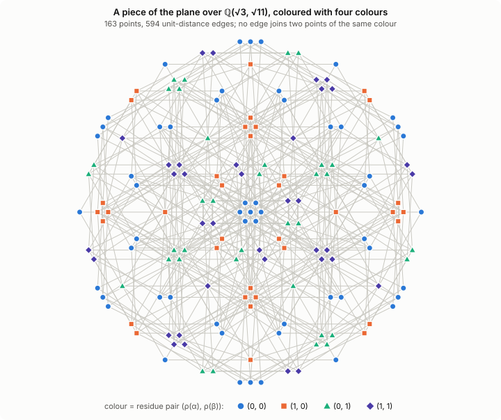
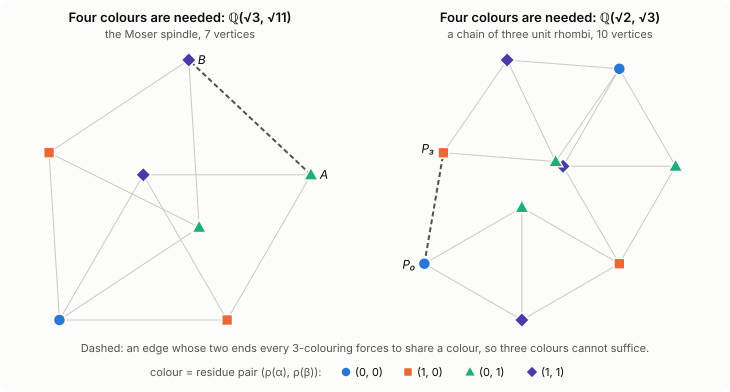

# The Hadwiger–Nelson problem over number fields

Project page: results, evidence, methods and references.

How many colours does the plane need so that no two points at distance exactly 1
share a colour? The answer, χ(ℝ²), has been known since 2018 to lie in
**{5, 6, 7}**.

| bound | value | who, when | how |
|---|---|---|---|
| lower | ≥ 4 | Nelson, 1950; L. and W. Moser, 1961 | the 7-vertex Moser spindle |
| lower | ≥ 5 | de Grey, 2018 | a 1581-vertex unit-distance graph with no 4-colouring |
| lower | ≥ 5 | Parts, 2020 | the same property on 509 vertices |
| upper | ≤ 7 | Isbell, 1950 | a hexagonal tiling |

This project aims at **χ(ℝ²) ≥ 6**. That needs one finite unit-distance graph
with no proper 5-colouring. A finite object can be searched for, and anyone can
check it once found.

**That graph has not been found.** Several results along the way are recorded
below, with their evidence.

## Principles

- **Exact arithmetic.** Coordinates live in number fields such as ℚ(√3, √11),
  never in floating point. "Distance exactly 1" is a decidable predicate.
- **Solvers, then certificates.** Colourability is decided by SAT solvers
  (kissat, CaDiCaL, Glucose, MiniSat). Positive answers ship as colourings,
  checked against edges rebuilt from the coordinates. Negative answers ship as
  DRAT proofs, checked by `drat-trim` against a formula rebuilt from the
  coordinates.
- **Nothing is announced unverified.** A claim of non-colourability needs:
  - an exact rebuild;
  - agreement between independent solvers;
  - a verified DRAT proof, with no hidden symmetry breaking.
- **Corrections stay visible.** Withdrawn claims are kept, with the reason, in
  the research log.

## Results

### Theorems

| statement | status | where |
|---|---|---|
| **χ(ℚ(√2, √3)²) = 4.** Voronov's second case; not found in the literature. | Proved (not yet refereed); unit tests. The lower bound was already implicit in Voronov–Neopryatnaya–Dergachev; a 10-vertex rhombus chain gives a short one. | `notes/local_colourings.md` §10, `tests/test_q23.py`, `certificates/chain23_no3coloring.json` |
| **χ(ℚ(√3, √11)²) = 4.** A theorem of K. G. Fischer (1994); a short new proof. | Fischer's theorem; our proof is not yet refereed; unit tests. | `notes/local_colourings.md` §8, `hn/adelic.py`, `tests/test_q311.py` |
| χ(ℚ(√−3, √−11)) = 4 and χ(ℚ(√−3, √−11, √−247)) = 5, as whole complex fields | Proved. Upper bounds by reduction at the primes 2 and 11; lower bounds from the Moser spindle and the 5-chromatic graph `five_rho7`. Not yet refereed. | `notes/local_colourings.md` §3, `notes/rigidity.md` |
| Necessary local conditions for a field to hold a 6-chromatic unit-distance graph | Proved (not yet refereed) | `notes/local_colourings.md` §5–§9, `scripts/fieldscreen.py` |

Both are written up in a three-page note,
[`docs/note/planes-4-chromatic.pdf`](docs/note/planes-4-chromatic.pdf).

**On χ(ℚ(√3, √11)²) = 4.** K. G. Fischer proved it in 1994 (*A planar
geometric graph of chromatic number four*, Congr. Numer. 104, 73–79). He
proved that ℚ(√p, √q)² has an additive 4-colouring for all p ≡ 3, q ≡ 11
(mod 16) with pq ≡ 1 (mod 32); for ℚ(√3, √11) the Moser spindle gives the
lower bound. His result seems to have been overlooked:
- Moorhouse (2010) left the value undetermined.
- Madore (2015) proved 4 ≤ χ ≤ 5.
- Exoo and Ismailescu (2018) asked whether a 5-chromatic unit-distance graph
  embeds in this plane.
- Voronov (Polymath16, 2021) wrote that χ = 4 "seems likely" for this plane and
  for the plane over ℚ(√2, √3), "but as far as I know, nobody has proved this
  yet".

Fischer's hypotheses exclude ℚ(√2, √3), and we have not found that case in the
literature. We found Fischer's paper only after the first version of the note
had been sent to two mathematicians; the note now credits it.

The proof reduces z = x + iy modulo a place of ℚ(√3, √11) above 2 (there are
two), which is inert in ℚ(i, √3, √11). Every unit vector becomes a nonzero
element of 𝔽₄, so the residue is a proper 4-colouring. In the coordinates
α = x + y/√3, β = 2y/√3 the proof is Madore's reduction argument (Prop. 3.2,
which his ¶6.6 states for any quadratic form); in the coordinates (x, y) that
argument fails at 2.

Fischer's colouring is additive, with values in ℤ/4. Speyer used reduction
modulo 2 in Polymath16 (thread 2, April 2018) to 4-colour the Moser ring. The
passage from a ring to the whole field by cosets is Madore's and Moorhouse's.
Our contribution is the choice of coordinates, which lets Madore's argument
work at the places over 2 (they are inert in L(i), so the reduction covers
every unit vector of the plane), and the case ℚ(√2, √3). None of this has
been refereed.

<p align="center">
  
</p>
<p align="center"><sub><b>Figure 1.</b> 163 points of the plane over ℚ(√3, √11) and their 594
unit-distance edges. Each point is coloured by the residue pair (ρ(α), ρ(β)) ∈ 𝔽₂²;
no edge joins two points of the same colour.</sub></p>

<p align="center">
  
</p>
<p align="center"><sub><b>Figure 2.</b> The two lower bounds: the Moser spindle over ℚ(√3, √11) and a
chain of three unit rhombi over ℚ(√2, √3). In a 3-colouring the dashed edge would join two
points of the same colour.</sub></p>

### Computations, machine-checked

| object | property | evidence |
|---|---|---|
| Moser spindle | no 3-colouring | `certificates/moser_spindle_no3coloring.json`, drat-trim |
| de Grey's 1581-vertex graph, rebuilt from his 39-point seed | no 4-colouring with one triangle pinned to 0, 1, 2 | `certificates/degrey_1581_no4coloring.json`, kissat plus drat-trim (13.1 M lemmas) |
| 19 vertices, 33 edges, vertex-critical | no 3-colouring. Unlike the Moser spindle, its obstruction combines two constraints, neither of which is forced on its own (research log) | `certificates/genuine_pair_19_no3coloring.json`, drat-trim |
| `data/five_247.json`, 1139 vertices, and `data/five_247_c.json`, 803 vertices, vertex-critical | 5-chromatic, in ℚ(√3, √11, √247). Not a record: Parts' 509 stands. | `tests/test_five_247.py`, research log |
| `data/W_moser_orbit_9_33.json`, 187 points | not 5-colourable with edges at 1 and at one Galois orbit of two distances. It would prove χ(ℝ²) ≥ 6 if a unit-distance gadget existed for that orbit. | four solvers plus drat-trim (research log) |
| `data/W_lattice_16_21_28_61.json`, 72 points | not 5-colourable with edges at 1, 4/√3, √7, √(28/3), √(61/3) | four solvers plus drat-trim (research log) |
| Coset colourings of the ρ₇ module | none is proper: 3 840 exact linear-programming (Stiemke) certificates | research log, "κ, the rotation every coset colouring is blind to" |

### What is closed, and why

The research log records the approaches that cannot reach six, with the
reason for each:
- symmetrised growth;
- spindling at five colours;
- coset and circular colourings as obstructions;
- fields whose local planes are 5-colourable.

See "What has been ruled out so far", "The search over operations is closed, by
a theorem" and "Why every known construction stops at five".

## The route to six searched in September 2026

The route is Exoo and Ismailescu's two-step reduction, which Polymath16 calls
"virtual edges":
1. a **witness**: a graph with edges at 1 and at some distances `d` that has
   no 5-colouring;
2. a **gadget** for each `d`: a unit-distance graph in which two points at
   distance `d` always get different colours.

Two observations that we have not found in the literature:
- **Repulsive distances.** Some distances, such as 2/√3, are coloured alike
  unusually rarely, so they are the natural gadget targets.
- **Galois orbits.** A Galois automorphism of the field maps gadgets to
  gadgets, so one gadget serves a whole orbit of distances. The 187-point
  witness above needs a single gadget.

The gadget searches ran as parallel jobs from 23 September 2026, described in
`notes/worker_jobs.md`. None had succeeded by 25 September.

## Layout

Each folder has its own README describing what is in it.

```
hn/             the library: exact fields, geometry, graphs, SAT colouring,
                certificates, local (adelic) colourings
tests/          pytest suite (615 tests; 5 marked slow)
scripts/        maintained tools: verification, growth, gates, field screens
                (indexed in scripts/README.md)
scripts/experiments/
                730 one-off exploratory scripts, kept as a record
data/           graphs and witnesses with exact coordinates (JSON; data/README.md)
certificates/   colourings, DRAT verification logs, non-colourability claims
                (certificates/README.md)
notes/          technical notes: local colourings, rigidity, literature, jobs
docs/research-log.md
                the full chronological log, including corrections
```

## Reproducing

```sh
cd research/hadwiger-nelson
python3 -m pip install -r requirements.txt   # python-sat, numpy, scipy, sympy, pytest
python3 -m pytest -q                         # the full suite takes hours
python3 -m pytest -q tests/test_q311.py      # the ℚ(√3, √11) theorem, seconds
sh scripts/worker_setup.sh                   # kissat and drat-trim, for the searches
```

GitHub Actions (`.github/workflows/tests.yml`) runs the fast part of the suite on
pushes to `main` and on pull requests: 346 tests in 28 files, in under two
minutes.

`scripts/verify_pair.py` rebuilds a unit-distance witness or gadget from its
JSON file, re-derives every edge exactly and runs the solvers. The two
multi-distance witnesses have their own checkers, listed in
`scripts/README.md`.

## How this work was produced

This is AI-assisted research. The code, the experiments and most of the
writing were produced with Claude (Anthropic), through Claude Code, under the
direction of Sergi Galán.

Every computational claim is machine-checked as described above. The
mathematical arguments are backed by tests wherever that is possible. **None
has been refereed or independently checked by a mathematician.** Treat them as
preprint-level claims. Corrections are welcome.

## References

- A. D. N. J. de Grey, *The chromatic number of the plane is at least 5*,
  Geombinatorics 28 (2018); [arXiv:1804.02385](https://arxiv.org/abs/1804.02385)
- G. Exoo, D. Ismailescu, *The chromatic number of the plane is at least 5: a
  new proof*, DCG 64 (2020); [arXiv:1805.00157](https://arxiv.org/abs/1805.00157)
- G. Exoo, D. Ismailescu, *A 6-chromatic two-distance graph in the plane*;
  [arXiv:1909.13177](https://arxiv.org/abs/1909.13177)
- M. J. H. Heule, *Computing small unit-distance graphs with chromatic number
  5*; [arXiv:1805.12181](https://arxiv.org/abs/1805.12181)
- J. Parts, *The chromatic number of the plane is at least 5: a human-verifiable
  proof*; [arXiv:2010.12661](https://arxiv.org/abs/2010.12661)
- J. Parts, *Graph minimization, focusing on the example of 5-chromatic
  unit-distance graphs in the plane* (the 509-vertex graph);
  [arXiv:2010.12665](https://arxiv.org/abs/2010.12665)
- K. G. Fischer, *Additive K-colorable extensions of the rational plane*,
  Discrete Math. 82 (1990) 181–195; *The connected components of the graph
  ℚ(√N₁, …, √N_d)²*, Congr. Numer. 72 (1990) 213–221 (Zbl 0733.05048); and
  *A planar geometric graph of chromatic number four*, Congr. Numer. 104 (1994)
  73–79 (Zbl 0836.05030)
- P. D. Johnson Jr., *Two-colorings of real quadratic extensions of ℚ² that
  forbid many distances*, Congr. Numer. 60 (1987) 51–58
- P. D. Johnson Jr., *Problems posed in or arising from "Colorings of metric
  spaces": status report*, Geombinatorics 9 (2000) 170–179 (a survey we have
  not seen)
- M. S. Payne, *Unit distance graphs with ambiguous chromatic number*,
  Electron. J. Combin. 16 (2009), Note 31;
  [arXiv:0707.1177](https://arxiv.org/abs/0707.1177) (summarises Johnson's and
  Fischer's results on quadratic fields)
- G. E. Moorhouse, *On the chromatic numbers of planes* (draft, 2010);
  [pdf](https://www.ericmoorhouse.org/pub/chromatic.pdf)
- D. A. Madore, *The Hadwiger–Nelson problem over certain fields*;
  [arXiv:1509.07023](https://arxiv.org/abs/1509.07023)
- Polymath16 threads
  [2](https://dustingmixon.wordpress.com/2018/04/22/polymath16-second-thread-what-does-it-take-to-be-5-chromatic/)
  and [3](https://dustingmixon.wordpress.com/2018/05/01/polymath16-third-thread-is-6-chromatic-within-reach/)
  (Speyer's 2-adic colourings of the Moser ring), and
  [17](https://dustingmixon.wordpress.com/2021/02/01/polymath16-seventeenth-thread-declaring-victory/)
  (Voronov's conjecture), and the Polymath16 wiki page
  [Algebraic formulation of Hadwiger–Nelson problem](https://web.archive.org/web/20210412075722/https://asone.ai/polymath/index.php?title=Algebraic_formulation_of_Hadwiger-Nelson_problem)
  (colourings of rings such as the Moser ring)
- V. A. Voronov, A. M. Neopryatnaya, E. A. Dergachev, *Constructing
  5-chromatic unit distance graphs embedded in the Euclidean plane and
  two-dimensional spheres*; [arXiv:2106.11824](https://arxiv.org/abs/2106.11824)
- Á. Dúcz, *A note on geometric colorings of the Moser lattice*;
  [arXiv:2606.12325](https://arxiv.org/abs/2606.12325)

`notes/literature.md` compares the project with the literature in detail.
